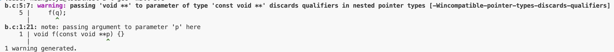
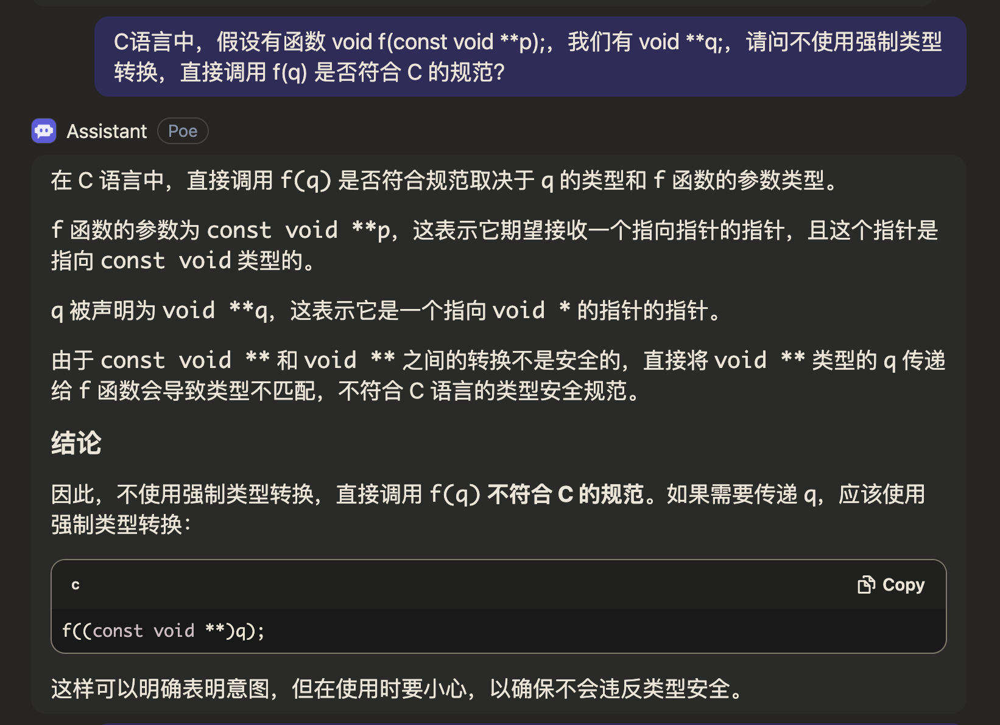
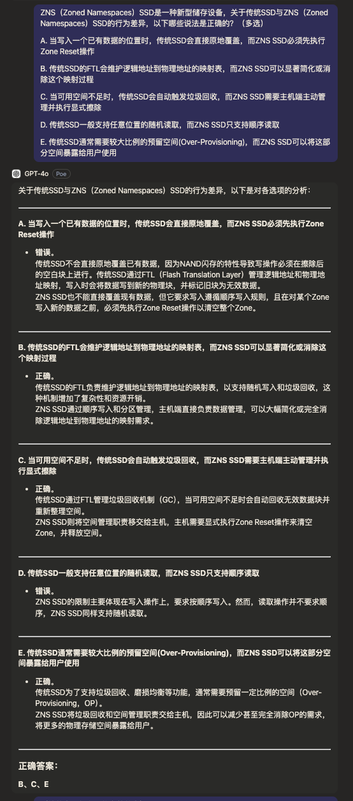
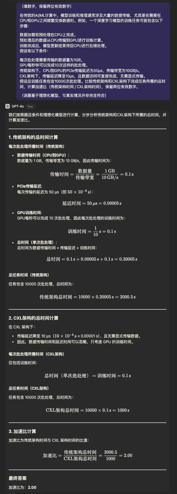
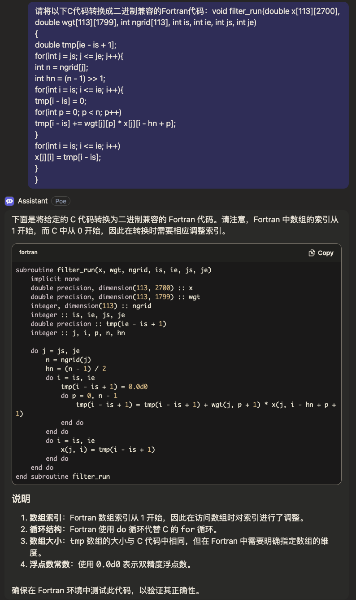

# Writeup

- 用户 UUID：`c2397abc-4dfa-4650-804a-465baf36e5e1`。
- 用户名：`≥﹏≤`。
- 邮箱：`2301213215@stu.pku.edu.cn`。

代码仓库将放在<https://github.com/TheVeryDarkness/hpcgame-2.git>，Writeup 提交截止后会公开。

|       |  A  |  B  |  C  |  D  |  E  |  F  |  G  |  H  |  I  |  J  |  K  |  L  | Total |
| :---: | :-: | :-: | :-: | :-: | :-: | :-: | :-: | :-: | :-: | :-: | :-: | :-: | :---: |
| ≥﹏≤  | 100 | 100 | 100 | 100 |  0  | 10  | 150 |  0  | 40  |  0  | 50  |  0  |  650  |
| Total | 100 | 100 | 100 | 100 | 150 | 200 | 200 | 260 | 200 | 100 | 50  | 200 | 1760  |

写 Writeup 的时候发现的 Copilot 冥场面：

~~我好菜啊~~

## 签到

在火车上用手机翻的。不过看到其中几位应该就能猜出来是什么了。

## 小北问答

仓库里会有当时用的 [Jupiter Notebook](./b.ipynb)。

一开始没注意到提交结果里会有每一道题的分数，所以中间瞎猜了两次。

### 鸡兔同笼

列方程手算即可。

$$
\begin{aligned}
2b+s &= 16 \\
b+s  &= 12 \\
b    &= 4  \\
s    &= 8  \\
\end{aligned}
$$

### 编程语言

找个编译器编译一下就知道了。而且 GPT 也能回答这个问题。





从类型论的角度来说，如果这两者兼容的话，可以往 `void **` 指向的地方写入 `const void *`，然后再作为 `void *` 读出来。

### CPU Architecture

能搜到，而且 GPT 也知道。

<https://developer.arm.com/documentation/102340/0100/Introducing-SVE2>


### MISC

<https://www.opencompute.org/documents/ocp-microscaling-formats-mx-v1-0-spec-final-pdf>

### 储存

上网搜完大部分选项都能判断。比如说 <https://zhuanlan.zhihu.com/p/669385346>



GPT 4o 问答链接（前两条）：<https://poe.com/s/7Df2bqQEvKMbPnMcVcrp>

换别的大模型给的答案不对。

### OpenMPI

<https://www.open-mpi.org/software/ompi/v5.0/>

<https://github.com/open-mpi/ompi/commit/8a5c2ef25dc8e4528f0d3fd2ec91a6578160af95>

~~<https://docs.open-mpi.org/en/main/installing-open-mpi/required-support-libraries.html>~~

### RDMA

<https://zhuanlan.zhihu.com/p/649468433>


### HPCKit

- HMPI <- OpenMPI
- KBLAS <- BLAS
- EXAGEAR 模拟器

### CXL

懒得想了，直接问大模型。

GPT 4o 问答链接（后两条）：<https://poe.com/s/7Df2bqQEvKMbPnMcVcrp>



换别的大模型给的答案不对。

### 量子计算

$$
\begin{aligned}
    H &= \frac{1}{\sqrt{2}} \begin{bmatrix}
        1 &  1 \\
        1 & -1 \\
    \end{bmatrix} \\
    H \ket{0} &= \frac{1}{\sqrt{2}} (\ket{0} + \ket{1}) \\
    H^2 &= E \\
    H^2 \ket{0} &= \ket{0} \\
\end{aligned}
$$

## 不简单的编译

_众所周知_，通常情况下，优化最好的编译器是 intel 的 icc/ifort，所以选择 intel 环境。

~~但是被后缀名晃晕了，以为这题给的源代码就是 Fortran 的，直接改 CMakeLists.txt 里的语言编译不了。~~

_众所周知_，对于科学计算而言，Fortran 一般比 C 优化得更好，所以选择 Fortran 语言。

然后用大模型根据原来的代码生成了个初版：



接下来就是改代码了。几个要点：

- 在编译选项里指定更高的优化等级和目标架构。
- CMake 里指定语言为 Fortran 而不是 FORTRAN。（CMake 大部分情况大小写不敏感，之前也没在 CMake 里用过 Fortran，脑子抽了）
- 要保证找得到符号的话，需要在 Fortran 里声明 `bind(C)`。部分情况下还需要指定符号的名字。
- C 中的二维数组是按行存储的，Fortran 中的二维数组是按列存储的，传入时的尺寸要换顺序。
- 默认情况下 Fortran 中数组是从 1 开始的，所以手动指定下标范围。（不过我看我之前提交的代码里有一个数组下标上界忘记减一了，还好是传指针）
- Fortran 默认按引用传参的，有几个非数组的参数需要指定成值传递。
- 用 `intent` 用来指定参数的读写权限。（没啥用，单纯怕自己不小心写错）

<https://gcc.gnu.org/onlinedocs/gfortran/Argument-passing-conventions.html>

<https://docs.oracle.com/cd/E19205-01/820-1204/6nct259sc/index.html>

## 最长公共子序列

上网搜了一下，发现[南京大学的 Lab](https://xliuqq.github.io/csblog/courses/os_lab/M2_plcs.html)里有这题，只需要换一下方向就能并行了。

想象了一下，分了三个阶段（假设 x 轴正方向从下到上，y 轴正方向从右到左，下面的数字表示阶段），以 $n_1 = 2, n_2 = 4$ 为例：

```txt
3 3 2 2 1
3 2 2 1 1
2 2 1 1 1
```

- 第一阶段为右下角的三角形，共计 $n_1 + 1$ 个斜行，由于右边界、下边界固定为 0，可以跳过前两个斜行。
- 第二阶段为平行四边形（如果 $n_1 < n_2$ 的话才有这一阶段），共计 $n_1 + n_2 - 1$ 个斜行。
- 第三阶段为左上角的三角形，共计 $n_2$ 个斜行。

共计 $n_1 + n_2 + 1$ 个斜行，循环时只需要保存前两个斜行的信息即可。

记第 $t$ 个斜行保存的信息为 $l_t$，$l_t[x] = dp[x][t - x], \max\{0, t-n_2-1\} \le x \le \min\{n_1, t\}$，即 `arr_1[0:x]` 和 `arr_2[0:t-x]` 的最长公共子序列长度。则

$$
\begin{aligned}
    l_{t+1}[x] &= \max \begin{cases}
        0                      & \text{if } x = 0 \text{ or } x = t \\
        l_{t-1}[x-1] + 1       & arr_1[x] = arr_2[t-x]              \\
        \max(l_t[x-1], l_t[x]) & \text{otherwise}
    \end{cases}
\end{aligned}
$$

最开始用 `#pragma omp parallel for schedule(static)`，发现拿不了满分，然后转念一想，负载应该不会太均衡，删掉静态调度，改成 `#pragma omp parallel for`，就能拿到满分了。

## 着火的森林

~~写了半天一分没拿到，寄！~~

~~虽然我觉得多进程并行非常难用，但是我感觉这题还挺有意思，写 Writeup 的时候终于改到能跑的程度了，但是结果还是不对。希望 POD 先别关。~~

## 雷方块

~~写了半天只拿到 10 分，发现自己还是太年轻了，错把示例当成宝。~~

## TopK

这题花了好久但是没拿到满分，破防了。~~本来之前提交次数只给了 15，看次数不够瞎蒙就去做别的题了，但是别的题也没做明白。不知道什么时候多给了 5 次。~~

- 先交了一次 baseline 试试水，发现水挺深。
- 接下来就想着按照归并排序的思路来，分段计算 TopK，然后合并。这样也不需要原子操作或者锁。
- 调了半天参，发现拿不到满分。
- 想结合一下线程池，但是发现性能还不如原来的。
- ~~我感觉我这种做法是在基于标准库的排序实现的情况下比较好的了，但是似乎 Julia 标准库中的排序的性能并没有到达极限。我感觉我做这题的时候还是没放开手脚。~~

## Posit GEMM

~~至今也不知道怎么编译。交了两次都没编译通过，零分。~~

## 刀锐奶化

刚好拿了 20% 的分数（40 分）。

Copilot 帮我把 baseline 中 CPU 执行的代码改成了 GPU 执行，我一开始没申请到 POD，没测试编译，交了一次编译失败（`norm` 和 `operator-` 没加 `__device__` 修饰符），修了一下，16%。

这玩意也不好截图，我直接把代码贴在下面吧。

```cpp
#include <math.h>
#include <stdio.h>
#include <malloc.h>
#include <stdint.h>

typedef double d_t;
struct d3_t {
    d_t x, y, z;
};

d_t norm(d3_t x) {
    return sqrt(x.x * x.x + x.y * x.y + x.z * x.z);
}

d3_t operator-(d3_t a, d3_t b) {
    return {a.x-b.x,a.y-b.y,a.z-b.z};
}

__global__ void kernel(d3_t src, d3_t* mir, d3_t* sen, d_t* data, int64_t mirn, int64_t senn) {
    int64_t i = blockIdx.x * blockDim.x + threadIdx.x;
    if (i < senn) {
        d_t a=0;
        d_t b=0;
        for (int64_t j = 0; j < mirn; j++) {
            d_t l = norm(mir[j] - src) + norm(mir[j] - sen[i]);
            a += cos(6.283185307179586 * 2000 * l);
            b += sin(6.283185307179586 * 2000 * l);
        }
        data[i] = sqrt(a * a + b * b);
    }
}

int main(){
    FILE* fi;
    fi = fopen("in.data", "rb");
    d3_t src;
    int64_t mirn,senn;
    d3_t* mir, * sen;

    fread(&src, 1, sizeof(d3_t), fi);

    fread(&mirn, 1, sizeof(int64_t), fi);
    mir = (d3_t*)malloc(mirn * sizeof(d3_t));
    fread(mir, 1, mirn * sizeof(d3_t), fi);

    fread(&senn, 1, sizeof(int64_t), fi);
    sen = (d3_t*)malloc(senn * sizeof(d3_t));
    fread(sen, 1, senn * sizeof(d3_t), fi);

    fclose(fi);

    d_t* data = (d_t*)malloc(senn * sizeof(d_t));

    d3_t* d_mir, * d_sen;
    d_t* d_data;

    cudaMalloc(&d_mir, mirn * sizeof(d3_t));
    cudaMalloc(&d_sen, senn * sizeof(d3_t));
    cudaMalloc(&d_data, senn * sizeof(d_t));

    cudaMemcpy(d_mir, mir, mirn * sizeof(d3_t), cudaMemcpyHostToDevice);
    cudaMemcpy(d_sen, sen, senn * sizeof(d3_t), cudaMemcpyHostToDevice);

    kernel<<<(senn + 255) / 256, 256>>>(src, d_mir, d_sen, d_data, mirn, senn);

    cudaMemcpy(data, d_data, senn * sizeof(d_t), cudaMemcpyDeviceToHost);

    cudaFree(d_mir);
    cudaFree(d_sen);
    cudaFree(d_data);

    fi = fopen("out.data", "wb");
    fwrite(data, 1, senn * sizeof(d_t), fi);
    fclose(fi);

    return 0;
}
```

测试了很多次，比如说改传参类型、改计算时使用的精度，但是神秘的物理学发挥作用了，把很多小数据加在一起时，对小数据的微小误差会放大，导致结果差得离谱。最后还是把 `cos` 和 `sin` 换成了 `cossin`，才多拿了 4%。

不过我发现的一点是：修改传参类型不会对性能有太大影响，但是修改计算精度会对性能有很大影响，说明瓶颈在计算上。

但是我今天突然想到这玩意不会是用泰勒展开计算吧？写完 Writeup 试试。

## HPL-MxP

~~太长了，甚至不知道要改哪，没提交，零分。~~

## 画板

编译选项没加 `-fopenmp`，用不了 OpenMP 捏，学学 pthread。

- 先试试创建 10 个线程，但感觉不太好，还是改成 8 个。
- 把 `/dev/urandom` 换成 `std::ranlux48_base`（一开始用的是 `std::mt19937_64`），应该能提高性能。
- 一开始让一个线程每次生成一个地址并与指定的前缀比较，找到与当前前缀匹配的密钥以后再换下一个（这样的话每一个前缀都需要一个锁，而且还需要经常 `lock_shared` 来判断某个前缀是否已经匹配到），后来意识到可以每次生成一个地址后比较所有前缀（这样的话只需要一个锁来保护需要写入的区域，以避免两个线程恰好同时找到一个前缀对应的密钥，而只需要用原子变量就可以表示每个前缀是否已经匹配到）。

## EDA

~~我看不懂但我大受震撼。小小零分，不成敬意。~~
